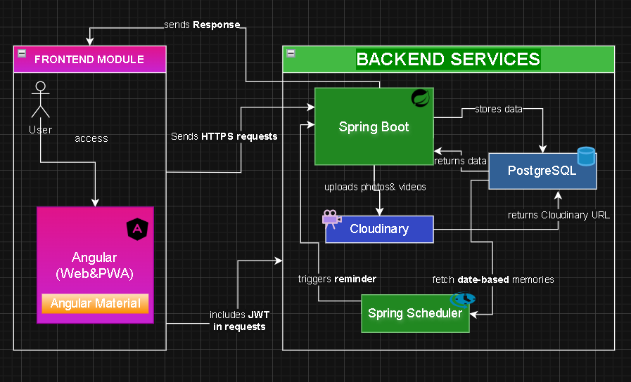

# 🧠 Memory App — System & Database Design

This repository is dedicated to tracking and organizing the **system architecture** and **database design** journey of the _Memory App_, a productivity tool that helps users save, categorize, and revisit personal or creative memories.

> 🎯 Objective: Design the entire backend architecture from scratch using Spring Boot with a strong emphasis on planning — including requirement gathering, data modeling, and API design.

### 🎨 UI Design
- 📱 [View the Figma Prototype](https://www.figma.com/design/tT1NeXsZG9n306nEg4QpU0/Untitled?node-id=0-1&t=J2jeNuKiBIQBmsho-1)
- ✨ Designed using [**Stitch by Google**](https://stitch.withgoogle.com/)

---

## 📚 Table of Contents

- [🛠 Requirement Analysis](#-requirement-analysis)
- [📐 System Design](#-system-design)
- [🗃️ Database Design](#-database-design)
- [📈 Diagrams](#-diagrams)
- [📃 License](#-license)

---

## 🛠 Requirement Analysis

### ✅ Core Features
- User registration and login (Authentication & Authorization)
- Create, view, edit, delete memories (with text, images, or video)
- Group memories into **boards**
- Drag & drop UI to rearrange memories across boards
- Calendar view for timeline-based visualization (optional)
- Daily memory reminder notifications (“On this day…”) (optional)

### 🧰 Non-Functional Requirements
- Secure media and user data handling
- Modular, scalable, and maintainable backend
- Media file upload support (Cloudinary / AWS S3)

---

## 📐 System Design

### 🔹 Overview
A layered architecture for separation of concerns:
- **Frontend** (Mobile & Web)
- **Backend API** (Spring Boot)
- **Database** (Relational)
- **Media Storage** (S3 or Cloudinary)
- **Scheduler/Notification Service** (optional)

### 🧩 Components
- Authentication Service (JWT-based)
- Memory & Media Service
- Board & Drag-n-Drop Service
- Notification Scheduler (optional)
- Calendar Module (optional)

### 📂 Design Process
- High-Level Design (HLD): System architecture, modules, technology decisions
- Low-Level Design (LLD): Class diagrams, service flow, database interaction patterns

---

## 🗃️ Database Design

- Modeled to ensure data integrity, relationship consistency, and efficient querying.
- Covers all core entities (Users, Memories, Boards, Media, Notifications, Tags)
- Focus on normalization and performance.

---

## 📈 Diagrams

| Diagram Type             | Description                                      | Status  |
|--------------------------|--------------------------------------------------|---------|
| System Architecture      | High-level overview of system components         | ✅ Added  |
| Use Case Diagram         | Functionalities from user's perspective          | ⏳ In Progress |
| Entity Relationship (ER) | Database schema, tables and their relationships  | Not started |
| Class Diagram            | Class-level interaction and structure (LLD)      | Not started |
| API Flow Diagram         | Request/response and endpoint interactions       | Not started |

### Architecture Diagram

## 📃 License

This project is licensed under the [MIT License](LICENSE).

---

## ✍️ Author

Built and maintained by Sana Gul — as part of a learning journey in full-stack system design and development.

